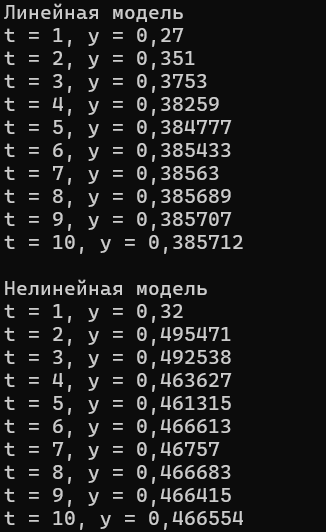

<p align="center">Министерство образования Республики Беларусь</p>
<p align="center">Учреждение образования</p>
<p align="center">“Брестский Государственный технический университет”</p>
<p align="center">Кафедра ИИТ</p>

<br><br><br>

<p align="center"><b>Лабораторная работа №1</b></p>
<p align="center">По дисциплине “Общая теория интеллектуальных систем”</p>
<p align="center">Тема: “Моделирование температуры объекта”</p>

<br><br><br>

<p align="right">Выполнил:</p>
<p align="right">Студент 2 курса</p>
<p align="right">Группы ИИ-28</p>
<p align="right">Деркач Е.В.</p>

<p align="right">Проверил:</p>
<p align="right">Иванюк Д.С.</p>

<br><br>

<p align="center">Брест, 2025</p>

---

# Цель работы

Разработка и реализация численной модели температурного процесса с использованием языка программирования **C++**.

---

# Общее задание

1. Написать отчёт по выполненной лабораторной работе №1 в формате `.md` и через pull request разместить его в каталоге:  
   `trunk/ii0xxyy/task_01/doc` (где `xx` — номер группы, `yy` — номер студента, например `ii02102`).

2. Исходный код программы разместить в каталоге:  
   `trunk/ii0xxyy/task_01/src`

---

# Математическая модель

Процесс изменения температуры управляемого объекта описывается дифференциальным уравнением:

$$
\frac{dy(\tau)}{d\tau} = \frac{u(\tau)}{C} + \frac{Y_0 - y(\tau)}{RC}
$$

После дискретизации получаются две модели:

### Линейная модель:
$$
y_{\tau+1} = a y_{\tau} + b u_{\tau}
$$

### Нелинейная модель:
$$
y_{\tau+1} = a y_{\tau} - b y_{\tau-1}^2 + c u_{\tau} + d \sin(u_{\tau-1})
$$

где:
- $\tau$ — дискретные моменты времени;
- $y(\tau)$ — температура объекта;
- $u(\tau)$ — входное тепло;
- $Y_0$ — температура помещения;
- $C$, $R$ — постоянные;
- $a$, $b$, $c$, $d$ — коэффициенты модели.

---

# Реализация на C++

```cpp 
#include <iostream>
#include <cmath>
#include <locale>
#include <stdexcept>

struct NonlinearParams {
    double a;
    double b;
    double c;
    double d;
    double u;
    double uPrev;
    double y;
    double yPrev;
};

double nextLinear(double a, double b, double u, double y)
{
    return a * y + b * u;
}

void simulateLinear(double a, double b, double u, int steps)
{
    if (steps <= 0) {
        throw std::invalid_argument("Number of steps must be positive");
    }

    std::cout << "Линейная модель" << std::endl;
    double y = 0.0;
    for (int i = 0; i < steps; i++)
    {
        std::cout << "t = " << i << ", y = " << y << std::endl;
        y = nextLinear(a, b, u, y);
    }
}

double nextNonlinear(const NonlinearParams& p)
{
    return p.a * p.y - p.b * (p.yPrev * p.yPrev) + p.c * p.u + p.d * sin(p.uPrev);
}

void simulateNonlinear(double a, double b, double c, double d, double u, int steps)
{
    if (steps <= 0) {
        throw std::invalid_argument("Number of steps must be positive");
    }

    std::cout << "Нелинейная модель" << std::endl;

    NonlinearParams p;
    p.a = a;
    p.b = b;
    p.c = c;
    p.d = d;
    p.u = u;
    p.uPrev = 0.0;
    p.y = 0.0;
    p.yPrev = 0.0;

    for (int i = 0; i < steps; i++)
    {
        std::cout << "t = " << i << ", y = " << p.y << std::endl;

        double yNext = nextNonlinear(p);

        p.yPrev = p.y;
        p.y = yNext;
        p.uPrev = p.u;
    }
}

int main()
{
    try
    {
        std::locale rus_locale("ru_RU.UTF-8");
        std::cout.imbue(rus_locale);
    }
    catch (const std::runtime_error &)
    {
        std::cerr << "Russian locale ru_RU.UTF-8 not available, using default locale." << std::endl;
    }

    try {
        double a1 = 0.3;
        double b1 = 0.3;
        double u1 = 0.9;
        int n1 = 10;
        simulateLinear(a1, b1, u1, n1);

        std::cout << std::endl;

        double a2 = 0.1;
        double b2 = 0.2;
        double c2 = 0.4;
        double d2 = 0.2;
        double u2 = 0.8;
        int n2 = 10;
        simulateNonlinear(a2, b2, c2, d2, u2, n2);

    } catch (const std::exception& e) {
        std::cerr << "Error: " << e.what() << std::endl;
        return 1;
    }

    return 0;
}

```

